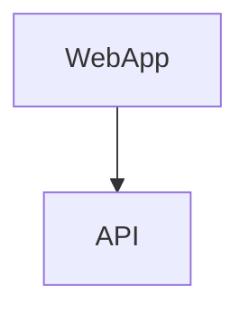

# ASP.Net Core web app call API with JWT authentication

## Design



## Setup Entra ID App registrations

You need to create two app registrations in Entra ID (Azure AD) for the web app and the API. Follow these steps:
- jjwebsec for web app
- jjwebapisec for API

Configure app registration for web app in Entra ID:
- add redirect URIs https://localhost:7045/signin-oidc
- create client secret and paste it in appsettings.json
- paste the client ID in appsettings.json

Configure app registration for API in Entra ID:
- update client ID in appsettings.json values ClientId and Audience
- update client ID in source code of web app calling API

## Deployment

### Host in Azure Container Apps

Configuration for web app:
- Environment variable: ASPNETCORE_FORWARDEDHEADERS_ENABLED=true to enable forwarded headers because of Entra ID forwarding schema.
- Environment variable: Api__BaseUrl to point to the base API URL.

### Protect API with Azure API Management

Configuration for API
- register API in Azure API Management - GET /api/values
- remove subscription key requirement
- add policy to validate JWT token

```xml
        <validate-azure-ad-token tenant-id="tenant_id">
            <audiences>
                <audience>client_id_backend_api_></audience>
            </audiences>
        </validate-azure-ad-token>
```
